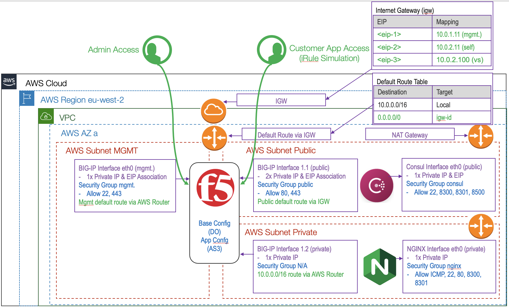

# autows201_demo

Before you use this repository, please follow the pre-requisites:

-   Create an AWS IAM for programmatic access, and save the access key and secret key to use in the next step.
-   Install aws cli and run 'aws configure'.  This will create a user credentials file ~/.aws/credentials - Terraform will use these credentials to access your AWS account for automation.

-   If you want to update the filter string, to identify a different AMI for use in this deployment.  You can use the aws cli to test your string... just experiment by changing `*BIGIP-15.1*PAYG-Best*25Mbps*` in the following command, to ensure you get one AMI returned:

    `aws ec2 describe-images --region eu-west-2 --filters "Name=name,Values=*BIGIP-15.1*PAYG-Best*25Mbps*" | grep '\"Name\"\|\"ImageId\"\|\"OwnerId\"'`

This deployment will build 

To deploy the infrastructure, you can:
-   cd ./terraform
-   terraform init
-   terraform plan
-   terraform apply

optionally, you can deploy the FAST declaration:
-   cd ../fast
-   terraform init
-   terraform plan
-   terraform apply

To destroy:
-   cd ../fast 
-   terraform destroy

-   cd ../terraform 
-   terraform destroy
